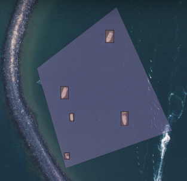

## Introduction

This project is made as a part of my studies at Poznan University of Technology. The topic of the project is "Implementacja wybranego algorytmu teledetekcyjnego w ramach wtyczki QGIS Deepness" ("Implementation of a selected remote sensing algorithm within the QGIS Deepness plug-in"). It was made under the care of Ph.D Marek Kraft.

## Project Overview

My project focuses training a YOLO model to detect a single class of objects and apply it inside QGIS Deepness. The selected class of objects are ships. Model is available in Pytorch format and ONNX format with annotations for ease of usage in QGIS Deepness

## Base model and dataset

My base model is YOLOv8s, and dataset is composed of multiple datasets from the internet:
- [Ship Detection from Aerial Images](https://www.kaggle.com/datasets/andrewmvd/ship-detection)
- [Ships in Google Earth](https://www.kaggle.com/datasets/tomluther/ships-in-google-earth)
- Select photos from [Boat detection in satellite imagery MASATI-V2](https://www.kaggle.com/datasets/louisaberdeen/masati-v2/data)

Combined set of photos was augumented in [Roboflow](https://universe.roboflow.com/) and exported in YOLO format.

## Prediction Example

     

